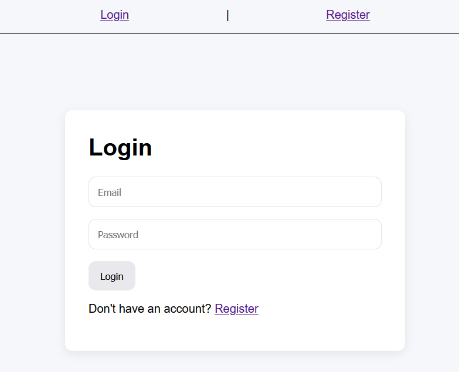
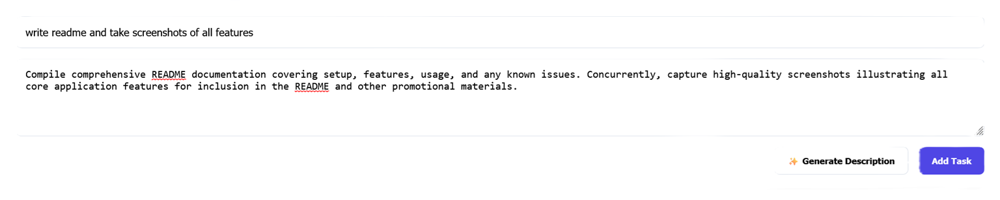
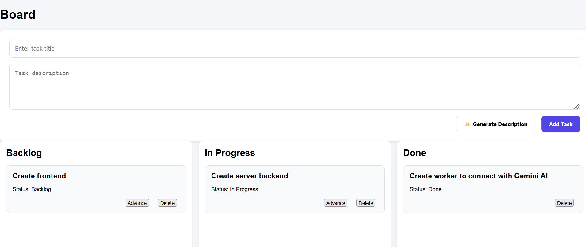

# FlowState

FlowState is a full-stack task management application built with React, TypeScript, Express, and PostgreSQL. The application allows users to create, manage, and organize tasks while leveraging AI-powered task description generation through Cloudflare Workers and Gemini AI.

## Features

* User registration and login
* JWT-based authentication and authorization
* User-specific task management
* Task status workflow (Backlog → In Progress → Done)
* AI-generated task descriptions
* PostgreSQL database persistence
* RESTful API architecture

## Tech Stack:

### Frontend

* React
* TypeScript
* React Router

### Backend

* Node.js
* Express
* JWT Authentication

### Database

* PostgreSQL

### AI Integration

* Cloudflare Workers
* Cloudflare AI Gateway
* Gemini AI

### Development Tools

* Git
* GitHub

## Architecture

Frontend (React)
↓
Backend API (Express)
↓
PostgreSQL

Backend API (Express)
↓
Cloudflare Worker
↓
Gemini AI

## Authentication Flow

1. User registers an account.
2. User logs in and receives a JWT.
3. JWT is stored locally.
4. Protected routes require a valid token.
5. Users can only access their own tasks.

## AI Workflow

1. User enters a task title.
2. Frontend sends a request to the backend.
3. Backend calls a Cloudflare Worker.
4. Cloudflare Worker communicates with Gemini AI.
5. Generated description is returned to the user.

## Future Improvements

* Task priorities
* Due dates
* Drag-and-drop task management
* Team collaboration
* AI-generated subtasks
* AI-generated sprint planning

## Local Setup

### Frontend

npm install

npm run dev

### Backend

npm install

npm run dev

### PostgreSQL

Create a PostgreSQL database and configure environment variables.

### Environment Variables

Backend:

DATABASE_URL=
JWT_SECRET=
AI_WORKER_URL=

Cloudflare Worker:

CLOUDFLARE_GATEWAY_TOKEN=
AI_BYOK_ALIAS=
AI_MODEL=
